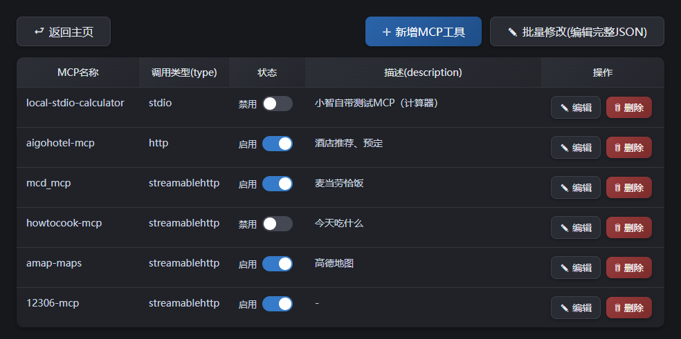

# 小智MCP服务windows客户端（一键安装）

# 介绍
基于Windows的可视化MCP管理桌面应用

本工具为小智MCP标准服务WebSocket桥接客户端，提供windows可视化GUI管理面板，面向小白支持一键安装，支持多MCP服务统一启停、状态可视化展示，大幅简化小智MCP服务对接流程，具体优势如下 👇

1. 一键安装
2. 环境自动隔离
3. 支持7种MCP运行状态的监控（启动、停止、重连、401、404、503 ... ）
4. 配置文件可视化编辑
5. 图形界面管理MCP，支持单独修改或批量修改MCP源
6. 多MCP接入
7. 所有厂商MCP的MCP配置自动兼容

本工具无任何收费功能，如果帮你节省了开发时间、解决了问题，欢迎 去B站三连支持一下 或者去 GitHub 点个 Star</b>，你动动手指就是对我最大的鼓励。

# 使用教程
bilibili：<a href="https://www.bilibili.com/video/BV11sMu6xEid">https://www.bilibili.com/video/BV11sMu6xEid</a>

# 关于项目
这是一个在虾哥开源的 ESP32 项目上扩展的一个桌面应用，目标是尽量做到小白零基础使用。  
项目以 MIT 许可证发布，允许任何人免费使用，修改或用于商业用途，希望能为小智AI的发展做出一些绵薄的贡献，如有任何想法或建议，请随时提出 Issues 或 在B站私信评论。

# 支持我
1. 感谢您的认可
2. 此软件永久免费，无付费内容，无功能限制
3. 若本工具为你节约了开发 / 使用成本，可自愿赞助支持后续迭代优化
4. 所有资金将用于<b>让我吃饱饭</b>以便于后续的维护与功能迭代

